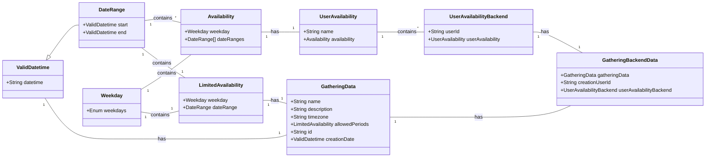

# Plan2Gather

Plan2Gather is an innovative open-source scheduling web application designed to streamline the process of organizing gatherings. Emphasizing privacy and convenience, Plan2Gather operates without the need for user accounts, ensuring your information remains confidential. The app automatically deletes data after use, further safeguarding your privacy.

Visit us at [https://plan2gather.net](https://plan2gather.net)!

Key Features:

- **Privacy-Centric**: No accounts needed, ensuring anonymity and security.
- **Auto Data Deletion**: Automatically deletes user data post-interaction for enhanced privacy.
- **Availability Collection**: Efficiently collects and manages users' availability.
- **Required Attendance Filter**: Allows gathering organizers to filter attendees based on the necessity of their presence.
- **Customizable Scheduling**: Restricts scheduling within specified time frames, such as a 9 AM to 5 PM window, according to the organizer's preferences.

Plan2Gather is perfect for teams and individuals seeking a hassle-free, secure, and efficient way to schedule gatherings. Join us in reshaping the way gatherings are planned!

## Figma Prototype

Our initial prototype for our CSC 307 class can be [viewed here](https://www.figma.com/file/s9YONOuOrl8I9VEbHSozyq/Plan2Gather?type=design&node-id=203%3A2&mode=design&t=f2rkCtoQH74eMCMq-1).

## Class Diagram

Our data structure for storing gathering data looks like:



## Developing

### Frontend

#### Start Frontend

To start the development server run `nx serve frontend`. Open your browser and navigate to <http://localhost:4200/>

#### Build Frontend

To build the frontend, run `nx build frontend`

#### Start Storybook

To run Storybook, run `nx run frontend:storybook`

### Backend

#### Start Backend

To start the development server for the backend run `nx serve frontend`. Open your browser and navigate to <http://localhost:4200/>. Happy coding!

#### Build Backend

To build the backend, run `nx build backend`

### Linting and Formatting

We follow the [AirBnB style guide](https://github.com/airbnb/javascript) and use ESLint and Prettier for linting and formatting.

#### Run ESLint

To run ESLint for linting your code, use the following command:

```bash
nx run-many -t lint
```

This command will lint all projects in your Nx workspace.

#### Run Prettier

To run Prettier for code formatting, use the following command:

```bash
nx format
```

This command will format the code in all projects in your Nx workspace according to the Prettier configuration.

Make sure to have the necessary ESLint and Prettier configurations in place to maintain code consistency.

### Generate code

If you happen to use Nx plugins, you can leverage code generators that might come with it.

Run `nx list` to get a list of available plugins and whether they have generators. Then run `nx list <plugin-name>` to see what generators are available.

Learn more about [Nx generators on the docs](https://nx.dev/plugin-features/use-code-generators).

### Running tasks

To execute tasks with Nx use the following syntax:

```
nx <target> <project> <...options>
```

You can also run multiple targets:

```
nx run-many -t <target1> <target2>
```

..or add `-p` to filter specific projects

```
nx run-many -t <target1> <target2> -p <proj1> <proj2>
```

Targets can be defined in the `package.json` or `projects.json`. Learn more [in the docs](https://nx.dev/core-features/run-tasks).
